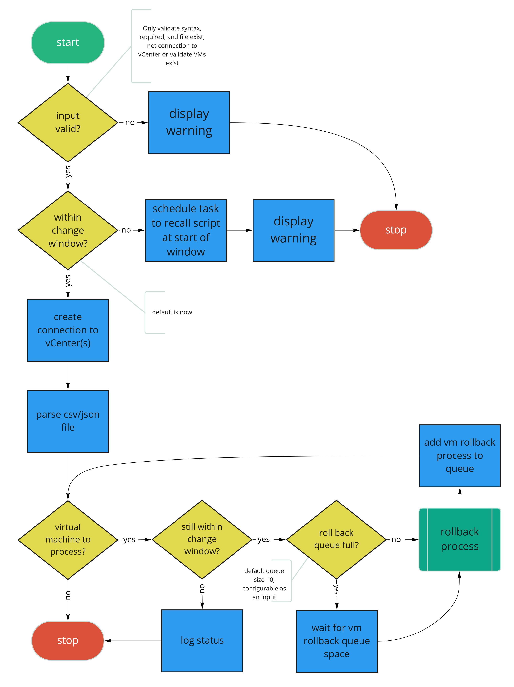
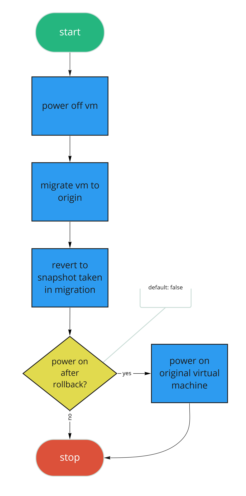
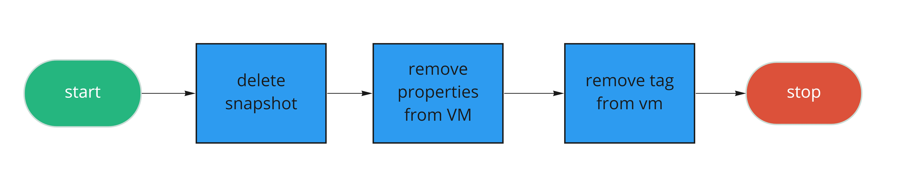

# Design  
This guide is intended to discuss the code in detail to assist future modifications without the support of the original 
authors. The sections below are design to give a clear picture of exactly what the code will do and provide insight into
the rational of the design.

## Overview
In order to maintain state and support rolling back after a VM has been migrated, the tool has three user selectable tasks: migration, state clean up, and rollback.
 - **Migration** - Migrate a set of machines
 - **Cleanup** - Cleanup the state on machines, either after a successful complete migration or from a failure that caused manual cleanup.
 - **Rollback** - Rollback machines back to their original location in the event of a post migration validation failure (see limitations section).

## Philosophy
The following list of statements define the guidelines used to develop the tool and resulting code.

- The tool should consist of support documentation and only one file to execute.
- Minimal libraries are required to execute the tool.
- Operate on the VMs as safely as possible while also maintaining the UUID.
- Best effort to provide performance without being overly complex.
- Maintain the state of the migrated VM with vSphere.
- Utilize a common and easy input file format.

## Conceptual Model
The conceptual model below shows the makeup of the "layers" of software. The tool will enter a dispatcher function that will make decisions about which function to call based on the requested task. Each of those tasks start at a controller who has the job to iterate over the VM list and throttle the execution. Inside each controller is a function to handle the task on an individual VM. 

## Logic Flow Diagrams
Below are the logic flow diagrams for each of the functions defined in the conceptual model.

### Dispatcher Flow
The dispatcher is the entry point into the tool; it makes decisions based on what task is requested.

### Migration Controller
The migration controller parses the VM list then manages throttling the number of individual VM tasks being executed at once.

### Migrate 
The migration process defines the logic for migrating an individual VM.

### Rollback Controller
The rollback controller parses the VM list then manages throttling the number of individual VM tasks being executed at once.

### Rollback 
The rollback process defines the logic for rolling back an individual VM.

### Cleanup Controller
The cleanup controller parses the VM list then manages throttling the number of individual VM tasks being executed at once.

### Cleanup 
The cleanup process defines the logic for cleaning up an individual VM.

