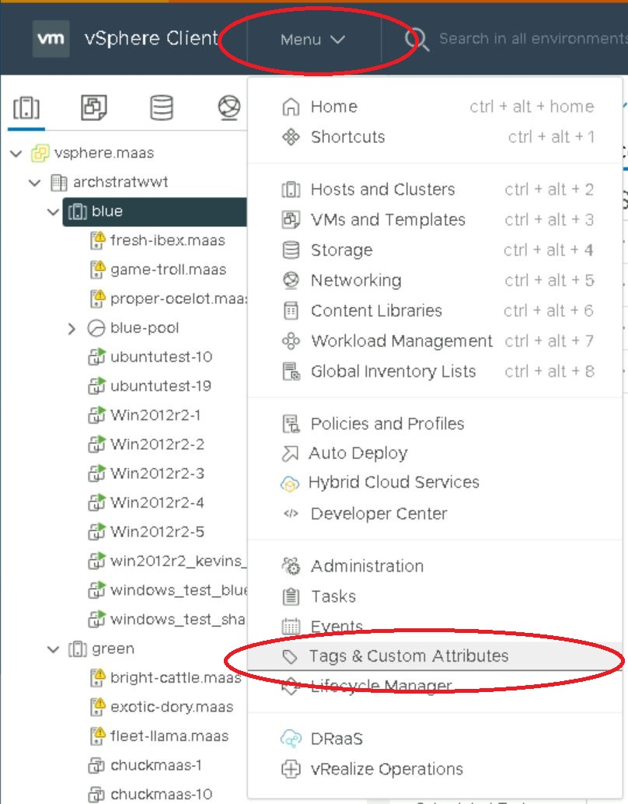
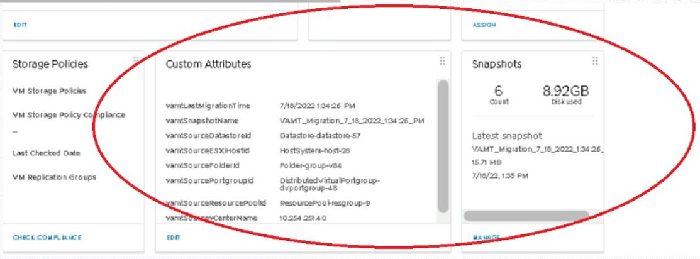
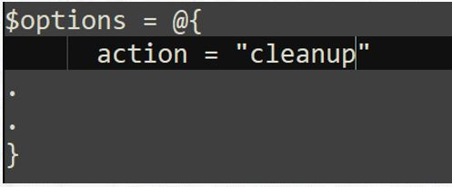

# VMware Architecture Migration Tool (VAMT)<br>Quick Start Guide (with examples)
---
The VMWare Architecture Migration Tool (VAMT) is a PowerShell script that uses VMWare PowerCLI to enable moving a VM from one hardware architecture (for instance Intel) to a different hardware architecture (for instance AMD).

There are some constraints and guidelines for this VM movement that are outlined in the full [Script User's Guide](./Script_Usage.md). The User's Guide covers more of the functional details for the runtime usage of the script and should be referred to for more thorough documentation. This Quick Start guide is intended to be a cheat sheet showing an example of the script usage that was captured during initial testing.

# Prerequisites
There are several prerequisites that need to be completed before the VAMT script can executed. Some of these prerequisites are in the vCenter settings while others are environmental ecosystem items. For more detailed documentation around the prerequisites, see the [Script Prerequisites](./Script_Prerequisites.md). A basic list of these are shown below.

- Host system capable of executing Windows PowerShell scripts as administrator
- Host system VMware PowerCLI installed in PowerShell (see one of the following links)
[Installing VMware PowerCLI](https://docs.vmware.com/en/VMware-vSphere/7.0/com.vmware.esxi.install.doc/GUID-F02D0C2D-B226-4908-9E5C-2E783D41FE2D.html) or [PowerCLI Installation Guide](https://developer.vmware.com/powercli/installation-guide)
- Administrator credentials on instance of the vcenter holding the clusters where the VMs live that are to be migrated
- Host system must have access to the vcenter where the VMs live
- Access to VAMT source repo:
	> Public repo link: [VMware Architecture Migration Tool](https://github.com/vmware-samples/vmware-architecture-migration-tool)
- If Distributed Resource Scheduler (DRS) is part of your vcenter, then it must be enabled on the clusters being migrated from and to 
	> 1) Navigate to cluster
[Link to Enabling VMware DRS from vSphere documentation](https://docs.vmware.com/en/VMware-vSphere/6.7/com.vmware.vsphere.mscs.doc/GUID-C228FA54-F621-45DA-8D62-AD8C118C89C0.html)
Sample screen shots:


	> 2) Edit cluster to enable DRS for compute resources
**NOTE: If using Datastore clusters, you must also enable Storage DRS on those as well if using the Datastore cluster as an input.**


- For email notifications to work see the example configuration below. The credentials need to be whatever is needed for SMTP authentication, such as:
	- username/password
	- IAM token
	- Security certificate/key
***Example @options setup:***
```
	[string]$userName = 'username@email.domain'
	[string]$userPassword = 'password'
	[securestring]$secStringPassword = ConvertTo-SecureString $userPassword -AsPlainText -Force
	[pscredential]$credObject = New-Object System.Management.Automation.PSCredential($userName, $secStringPassword)
	$options = @{
	.
	.
		toEmail = "tousername@email.domain"
		fromEmail = "fromusername@email.domain"
		smtpServer = "a.b.c.d:port"
		secureMailCred = $credObject
		smtpUseSsl = $true
	.
	.
	}
	.\VMwareArchitectureMigrationTool.ps1 @options
```
- For syslog to work:
	- Need to have a syslog server set up and accessible from the execution host
	- The options hash table argument needs to point to that valid IP address
***Example @options setup:***
```
	$options = @{
	.
	.
		syslogHost = "a.b.c.d:port"
	.
	.
	}
	.\VMwareArchitectureMigrationTool.ps1 @options
```
# Pre-migration notes
<b>NOTES:
- Much of this setup can be automated once the user is familiar with the environment. There are example PowerShell/PowerCLI scripts in the vamt_dir repo that can be used for enabling this automation.

- The first time the script is ran in a PS session you may see warnings that look like the following. These are from PowerCLI and can be safely ignored.</b><br>
*Example warnings that may be seen:*
```
WARNING: The 'Version' property of VirtualMachine type is deprecated. Use the 'HardwareVersion' property instead.
WARNING: The 'DrsMode' property of Cluster type is deprecated. Use the 'DrsAutomationLevel' property instead.
WARNING: The 'Accessible' property of Datastore type is deprecated. Use the 'State' property instead.
WARNING: The 'State' property of VMHost type is deprecated. Use the 'ConnectionState' property instead.
WARNING: PowerCLI scripts should not use the 'DatastoreIdList' property of VMHost type. The property will be removed in a future release.
WARNING: The 'IsChildTypeVm' property of the Folder type is deprecated. Use the Type property instead.
WARNING: The 'IsChildTypeComputeResource' property of the Folder type is deprecated. Use the Type property instead.
WARNING: The 'IsChildTypeDatacenter' property of the Folder type is deprecated. Use the Type property instead.
WARNING: The 'IsChildTypeDatastore' property of the Folder type is deprecated. Use the Type property instead.
WARNING: The 'Quiesced' property of Snapshot type is deprecated and will be removed in a future release.
WARNING: The 'Parent' property of Snapshot type is deprecated. Use the 'ParentSnapshot' property instead.
```

# Migration

## 1) Pull vamt_dir git repository down to the execution host
***Example repo clone:***
```
user@MYSYSTEM:/vmtest$ git clone git@github.com:vmware-samples/vmware-architecture-migration-tool.git
Cloning into 'vmware-architecture-migration-tool'...
remote: Enumerating objects: 260, done.
remote: Counting objects: 100% (89/89), done.
remote: Compressing objects: 100% (68/68), done.
remote: Total 260 (delta 45), reused 50 (delta 21), pack-reused 171
Receiving objects: 100% (260/260), 2.74 MiB | 8.14 MiB/s, done.
Resolving deltas: 100% (128/128), done.
```

## 2) Set up desired onetime session settings for migration and interaction with VMware PowerCLI
```
Set-PowerCLIConfiguration -Scope User -ParticipateInCeip $true -InvalidCertificateAction Ignore
Set-PowerCLIConfiguration -DisplayDeprecationWarnings:$false -Scope User
```

## 3) Add required single cardinality VM tags in vSphere category VAMT. These tags are used to drive the migration and/or rollback process.

**NOTE: The VAMT category and required tags can also be programmatically set up using PowerCLI.**

> 3.1) Get most recent list of tags required for the migration process from the script source:
[Link to list of migration tags in source](../VMwareArchitectureMigrationTool.ps1#L152)
```
tagCatName = "VAMT"
readyTagName = "readyToMigrate"
inProgressTagName = "inProgress"
completeTagName = "complete"
completeWithErrorsTagName = "completeWithErrors"
failedTagName = "failed"
readyToRollbackTagName = "readyToRollback"
rollbackTagName = "rolledBack"
```

> 3.2) Create the VAMT tag category, using the "Tags & Custom Attributes" window off the main "Menu" pulldown



This category must be single cardinality (i.e. the "Tags Per Object" needs to be set to "One Tag"), so that only 1 tag of that category can be applied to any given VM. While all of the "Associable Object Types" for that tag are checked, can probably get by with either "All Objects" or just "Virtual Machine". <br>
Once this tag category is created as shown above, save this for use with the next step of setting up the tags.

> 3.3) Create the tags shown above in the VAMT tag category


## 4) Create list of VMs to migrate in .csv format

[Example CSV file](../example/toMigrate.csv)

For this captured example runthrough, the following set of values was used in a file called "toMigrate.csv", much like the one shown in the link above:
```
vmname,target_hostpoolcluster,target_portgroup,target_datastore
Win2012r2-1,green,VLAN819-Green,Green
Win2012r2-2,green,VLAN819-Green,Green
Win2012r2-3,green,VLAN819-Green,Green
Win2012r2-4,green,VLAN819-Green,Green
Win2012r2-5,green,VLAN819-Green,Green
```

## 5) Set up helper for for script execution
The TestMigrate.ps1 PowerShell script example below shows one way that the options hash table can be customized and used to invoke the migration script.  You can also embed the hash table setup in to other scripts or calls from your own tooling, set these variables up as part of a separate script, or you can pass the various options in as list of command line arguments to the migration script itself.  This is the approach that was executed for collecting the screenshots throughout the following examples, however this is just one approach.

*TestMigrate.ps1*
```
[string]$userName = 'username@email.domain'
[string]$userPassword = 'password'
[securestring]$secStringPassword = ConvertTo-SecureString $userPassword -AsPlainText -Force
[pscredential]$credObject = New-Object System.Management.Automation.PSCredential($userName, $secStringPassword)

$options = @{
	action = "migrate"
	vcenters = "a.b.c.d"
	inputFilePath = ".\example\toMigrate.csv"
	changeWindowStart = "7/11/2022 13:16:58"
	changeWindowDuration = 0
	parallelTaskCount = 5
	syslogHost = "a.b.c.d:port"
	toEmail = "tousername@email.domain"
	fromEmail = "fromusername@email.domain"
	smtpServer = "a.b.c.d:port"
	secureMailCred = $credObject
	smtpUseSsl = $true
	Debug = $false
	debugLogging = $true
}
.\VMwareArchitectureMigrationTool.ps1 @options
```

This helper script can be run from anywhere [VMwareArchitectureMigrationTool.ps1](../VMwareArchitectureMigrationTool.ps1), [VAMT.psm1](../VAMT.psm1), and the migration targets inputs .csv file ([Example CSV file](../example/toMigrate.csv)) exist. A convenient location to execute the script is from the root of the repo after cloning it down from git. 

Example:
```
PS C:\Users\admin\Test\vamt_dir> dir
  Directory: C:\Users\admin\Test\vamt_dir
LastWriteTime     Length  Name
-------------     ------  ----
7/14/2022 11:03 AM  .    example
7/17/2022  6:22 PM  .    vamt_runlogs
7/14/2022  2:53 PM  .    wiki
7/6/2022  4:10 PM  15    .gitignore
7/11/2022 12:41 PM  528   README.md
7/17/2022  7:03 PM  260   VAMT.psm1
7/15/2022  3:23 PM  103801  VMwareArchitectureMigrationTool.ps1
```

## 6) Clean up any existing VAMT tags and add the readyToMigrate VAMT tag to all VMs to be migrated

The next thing to do is to set the tags up to be ready for migration in vcenter. As in the other examples in this document, this can be automated using an approach outlined in the example script shown above, however this cheat sheet shows how it is done in the vSphere UI.

> 6.1) First navigate to the list of VMs you want to migrate. We found it convenient during initial testing to group these into folders for easy selection.


> 6.2) Once you have the list of VMs you want to migrate from one cluster to the other, you need to remove any existing VAMT tags from those VMs. Since that VAMT tag category is set up with single cardinality only 1 tag can exist per VM from that category, so this makes sure they are all removed before doing the migration.


> 6.3) Now add the readyToMigrate VAMT tag to the list of VMs


To double check that the tag is assigned properly, you can look at the VM summary


## 7) Execute migration
In this example, the 5 VMs are going to be migrated from the blue cluster shown below to the green cluster. In this test setup, the blue cluster are Intel hosts, while the green cluster are AMD hosts.


> 7.1) Open up a PowerShell window on the execution host

As described in the prerequisites and setup, PowerCLI must be installed and the execution host needs network access to the vcenter as well as administrator credentials.


> 7.2) Execute the migration using the helper script

If all is set up properly, the script will then shut down the VMs and begin migrating them to the other cluster architecture.


> 7.3) Check migration is in progress in vcenter between the architectures (Intel to AMD, in this case)

As the migration executes, you should see the VM tasks running in the vsphere task window


> 7.4) Check migration status once complete

Once the migration is complete, you will get a status summary about the migration. Any errors encountered along the way are logged as well.

```
[Info] 07/18/2022 10:51:45 - There are currently 5 moves in progress and 0 moves waiting to start.
[Info] 07/18/2022 10:52:00 - VM move job for 'Win2012r2-4' is complete.
[Info] 07/18/2022 10:52:00 - There are currently 4 moves in progress and 0 moves waiting to start.
[Info] 07/18/2022 10:52:15 - There are currently 4 moves in progress and 0 moves waiting to start.
[Info] 07/18/2022 10:52:30 - VM move job for 'Win2012r2-2' is complete.
[Info] 07/18/2022 10:52:30 - VM move job for 'Win2012r2-5' is complete.
[Info] 07/18/2022 10:52:30 - There are currently 2 moves in progress and 0 moves waiting to start.
[Info] 07/18/2022 10:52:45 - VM move job for 'Win2012r2-1' is complete.
[Info] 07/18/2022 10:52:45 - VM move job for 'Win2012r2-3' is complete.
[Info] 07/18/2022 10:52:46 - migrate target states:

tgt_vm   tgt_compute tgt_network  tgt_storage tag_state job_state job                    attempts
------   ----------- -----------  ----------- --------- --------- ---                    --------
Win2012r2-1 green    VLAN819-Green Green    complete Completed System.Management.Automation.PSRemotingJob    1
Win2012r2-2 green    VLAN819-Green Green    complete Completed System.Management.Automation.PSRemotingJob    1
Win2012r2-3 green    VLAN819-Green Green    complete Completed System.Management.Automation.PSRemotingJob    1
Win2012r2-4 green    VLAN819-Green Green    complete Completed System.Management.Automation.PSRemotingJob    1
Win2012r2-5 green    VLAN819-Green Green    complete Completed System.Management.Automation.PSRemotingJob    1

[Info] 07/18/2022 10:52:46 - Script run summary:
    Script start: '07/18/2022 10:44:22'
    Script runtime: 8 minutes
    Script completion: '07/18/2022 10:52:46'
[Info] 07/18/2022 10:52:46 - Final report:

tgt_compute tgt_network  job_result              tgt_storage tag_state job_state attempts tgt_vm
----------- -----------  ----------              ----------- --------- --------- -------- ------
green    VLAN819-Green Successfully moved VM 'Win2012r2-1'. Green    complete Completed 1    Win2012r2-1
green    VLAN819-Green Successfully moved VM 'Win2012r2-2'. Green    complete Completed 1    Win2012r2-2
green    VLAN819-Green Successfully moved VM 'Win2012r2-3'. Green    complete Completed 1    Win2012r2-3
green    VLAN819-Green Successfully moved VM 'Win2012r2-4'. Green    complete Completed 1    Win2012r2-4
green    VLAN819-Green Successfully moved VM 'Win2012r2-5'. Green    complete Completed 1    Win2012r2-5

[Info] 07/18/2022 10:52:46 - Preparing to send final status email.
Transcript stopped, output file is C:\Users\admin\Test\vamt_dir\vamt_runlogs\20220718-104422\transcript-20220718T1044221610.log
PS C:\Users\admin\Test\vamt_dir>
```

You can double check to make sure that the migrated VMs from the blue Intel cluster ended up on the correct green AMD cluster:


And as an additional validation, you can examine the final state of each VM. You can check each one to see that the VAMT tag is showing complete, that the VM is now moved to the AMD green cluster, and that the VM is powered back up on the green network with the green datastore in this example.


# Rollback
VMs can be rolled back from the migrated cluster at any point in time after a migration operation is complete. Rollback basically can be thought of as a reverse migration, going from the target cluster that the VM was migrated to back to the original cluster it started in.

Once a migration has been completed, there is information stored in the custom attributes along with a snapshot that was taken for that VM:

This is the information that is then used to drive the rollback. 

## 1) Change operation action in options to rollback
To execute a rollback in it's simplest form, just change the operation action in the options from "migrate" to "rollback":
```
$options = @{
      action = "rollback"
.
.
}
```
## 2) Verify the VMs you want to rollback in the input .csv file
Note that while the input argument file will contain the list of VMs to roll back in the same way as with migration, only the VM name itself is actually used by the script from the migration .csv file during the rollback. All of the other information needed for the rollback comes from the custom attributes and snapshot data shown above. The other fields for cluster, network, and datastore can safely be left in there, as shown in the example, they just won't be used during the rollback.  Instead, the information that was stored as part of the snapshot and custom attributes when the migration was done is used for the cluster, network, and datastore.
```
vmname,target_hostpoolcluster,target_portgroup,target_datastore
Win2012r2-1,blue,VLAN819-Blue,Blue
Win2012r2-2,blue,VLAN819-Blue,Blue
Win2012r2-3,blue,VLAN819-Blue,Blue
Win2012r2-4,blue,VLAN819-Blue,Blue
Win2012r2-5,blue,VLAN819-Blue,Blue
```
## 3) Set the VAMT tags up to be ready for rollback

Much like the migration, the VAMT tags on the VMs are used to drive the rollback state as it executes. Before the rollback operation is initiated, the VMs need to have any former VAMT tags (like complete, completeWithErrors, etc.) removed and then the VAMT tag set indicating they are ready to rollback, as shown below:


## 4) Execute the rollback
In this example, even though the target cluster, network, and datastore show the blue cluster information, since the VMs currently reside on the blue cluster and the operation is a rollback, the stored information in the custom attributes will move it back to the green cluster.

```
PS C:\Users\admin\Test\vamt_dir> .\TestMigrate.ps1
Transcript started, output file is C:\Users\admin\Test\vamt_dir\vamt_runlogs\20220719-103518/transcript-20220719T1035181154.log
[Info] 07/19/2022 10:35:18 - Beginning inputs file validation.
[Info] 07/19/2022 10:35:18 - Inputs CSV file successfully validated for completeness.
[Info] 07/19/2022 10:35:18 - Change window start time: 07/11/2022 13:16:58
[Info] 07/19/2022 10:35:18 - Change window does not have an end time.
[Info] 07/19/2022 10:35:18 - Current time (07/19/2022 10:35:18) is within the specified change window. Proceeding with script now.
[Debug] 07/19/2022 10:35:18 - No credential for vCenter 10.254.251.40 was passed in via input parameter. Starting stored credential retrieval.
[Debug] 07/19/2022 10:35:18 - Found credential for vCenter 10.254.251.40. User: administrator@vsphere.local
[Info] 07/19/2022 10:35:18 - Logging in to vCenter 10.254.251.40 with User: administrator@vsphere.local
[Info] 07/19/2022 10:35:20 - All tags and categories have been validated.
[Info] 07/19/2022 10:35:20 - Found vm attribute 'vamtSourcevCenterName' in vCenter '10.254.251.40'. No action required.
[Info] 07/19/2022 10:35:20 - Found vm attribute 'vamtSourceESXiHostId' in vCenter '10.254.251.40'. No action required.
[Info] 07/19/2022 10:35:20 - Found vm attribute 'vamtSourceResourcePoolId' in vCenter '10.254.251.40'. No action required.
[Info] 07/19/2022 10:35:20 - Found vm attribute 'vamtSourceFolderId' in vCenter '10.254.251.40'. No action required.
[Info] 07/19/2022 10:35:20 - Found vm attribute 'vamtSourceDatastoreId' in vCenter '10.254.251.40'. No action required.
[Info] 07/19/2022 10:35:20 - Found vm attribute 'vamtSourcePortgroupId' in vCenter '10.254.251.40'. No action required.
[Info] 07/19/2022 10:35:20 - Found vm attribute 'vamtLastMigrationTime' in vCenter '10.254.251.40'. No action required.
[Info] 07/19/2022 10:35:20 - Found vm attribute 'vamtSnapshotName' in vCenter '10.254.251.40'. No action required.
[Info] 07/19/2022 10:35:22 - Pre-rollback target states:

tgt_vm   tgt_vc    tgt_host      tgt_respool tgt_folder tgt_network  tgt_datastore tgt_snapshot            tag_state    job_state
------   ------    --------      ----------- ---------- -----------  ------------- ------------            ---------    ---------
Win2012r2-1 10.254.251.40 exotic-dory.maas  Resources  test_net_1 VLAN819-Green Green     VAMT_Migration_7_18_2022_1:34:26_PM readyToRollback readyToRollback
Win2012r2-2 10.254.251.40 exotic-dory.maas  Resources  test_net_1 VLAN819-Green Green     VAMT_Migration_7_18_2022_1:34:26_PM readyToRollback readyToRollback
Win2012r2-3 10.254.251.40 fleet-llama.maas  Resources  test_net_1 VLAN819-Green Green     VAMT_Migration_7_18_2022_1:34:26_PM readyToRollback readyToRollback
Win2012r2-4 10.254.251.40 fleet-llama.maas  Resources  test_net_1 VLAN819-Green Green     VAMT_Migration_7_18_2022_1:34:26_PM readyToRollback readyToRollback
Win2012r2-5 10.254.251.40 bright-cattle.maas Resources  test_net_1 VLAN819-Green Green     VAMT_Migration_7_18_2022_1:34:26_PM readyToRollback readyToRollback

[Info] 07/19/2022 10:35:22 - There are currently 0 moves in progress and 5 moves waiting to start.
[Info] 07/19/2022 10:35:22 - New batch of moves: Win2012r2-4, Win2012r2-5, Win2012r2-3, Win2012r2-1, Win2012r2-2
[Info] 07/19/2022 10:35:58 - There are currently 5 moves in progress and 0 moves waiting to start.
.
.
```
At this point, the rollback should show in progress in vcenter, much the same as the migration:


## 5) Verify the rollback once completed
Once the rollback has completed, you should receive the same type of operation status summary as received with migration:
```
[Info] 07/19/2022 10:43:00 - Preparing to set 'complete' tag on 'Win2012r2-1'
[Info] 07/19/2022 10:43:00 - Successfully to set 'complete' tag on 'Win2012r2-1'
[Info] 07/19/2022 10:43:00 - Preparing to set 'complete' tag on 'Win2012r2-2'
[Info] 07/19/2022 10:43:00 - Successfully to set 'complete' tag on 'Win2012r2-2'
[Info] 07/19/2022 10:43:00 - Preparing to set 'complete' tag on 'Win2012r2-3'
[Info] 07/19/2022 10:43:00 - Successfully to set 'failed' tag on 'Win2012r2-3'
[Info] 07/19/2022 10:43:00 - Preparing to set 'complete' tag on 'Win2012r2-4'
[Info] 07/19/2022 10:43:00 - Successfully to set 'complete' tag on 'Win2012r2-4'
[Info] 07/19/2022 10:43:00 - Preparing to set 'complete' tag on 'Win2012r2-5'
[Info] 07/19/2022 10:43:00 - Successfully to set 'complete' tag on 'Win2012r2-5'
[Info] 07/19/2022 10:43:00 - There are currently 1 moves in progress and 0 moves waiting to start.
[Info] 07/19/2022 10:43:15 - There are currently 1 moves in progress and 0 moves waiting to start.
[Info] 07/19/2022 10:43:30 - VM move job for 'Win2012r2-1' is complete.
[Info] 07/19/2022 10:43:30 - rollback target states:

tgt_vm   tgt_vc    tgt_host      tgt_respool tgt_folder tgt_network  tgt_datastore tgt_snapshot            tag_state     job_state
------   ------    --------      ----------- ---------- -----------  ------------- ------------            ---------     ---------
Win2012r2-1 10.254.251.40 exotic-dory.maas  Resources  test_net_1 VLAN819-Green Green     VAMT_Migration_7_18_2022_1:34:26_PM rolledBack     Completed
Win2012r2-2 10.254.251.40 exotic-dory.maas  Resources  test_net_1 VLAN819-Green Green     VAMT_Migration_7_18_2022_1:34:26_PM rolledBack     Completed
Win2012r2-3 10.254.251.40 fleet-llama.maas  Resources  test_net_1 VLAN819-Green Green     VAMT_Migration_7_18_2022_1:34:26_PM rolledBack     Completed
Win2012r2-4 10.254.251.40 fleet-llama.maas  Resources  test_net_1 VLAN819-Green Green     VAMT_Migration_7_18_2022_1:34:26_PM rolledBack     Completed
Win2012r2-5 10.254.251.40 bright-cattle.maas Resources  test_net_1 VLAN819-Green Green     VAMT_Migration_7_18_2022_1:34:26_PM rolledBack     Completed

[Info] 07/19/2022 10:43:30 - Script run summary:
    Script start: '07/19/2022 10:35:18'
    Script runtime: 8 minutes
    Script completion: '07/19/2022 10:43:30'
[Info] 07/19/2022 10:43:30 - Final report:

tgt_folder tgt_network  job_result
---------- -----------  ----------
test_net_1 VLAN819-Green Successfully rolled back VM 'Win2012r2-1'.
test_net_1 VLAN819-Green Successfully rolled back VM 'Win2012r2-2'.
test_net_1 VLAN819-Green Successfully rolled back VM 'Win2012r2-3'.
test_net_1 VLAN819-Green Successfully rolled back VM 'Win2012r2-4'.
test_net_1 VLAN819-Green Successfully rolled back VM 'Win2012r2-5'.
[Info] 07/19/2022 10:43:30 - Preparing to send final status email.
```
As with the migration example, you can also validate the rollback via vcenter or via PowerCLI script calls to read the VM state.

# Cleanup
Once migration and/or rollback operations are completed, the cleanup operation can be used to remove the snapshots and custom attributes that were stored during their execution.

As you can see from the migration and rollback operation examples, the snapshots that are created may tend to accrue on the system over time; on large deployments these represent wasted space.  The job of the cleanup operation action is to clean these snapshots up, remove any VAMT tags, and remove the custom attributes that were set up once the migration and/or rollback operations are completed.



As mentioned before, the rollback and cleanup execution mechanisms are virtually identical to migration; the simplest approach to cleaning up is to replace the operation action in the input @options with “cleanup” action and they use the same .CSV file as input.



For cleanup, however, as with rollback, only the VM names in the input .CSV file are used; the cluster/host, network, and datastore are ignored, and the required cleanup information comes from the snapshot and custom attributes.
